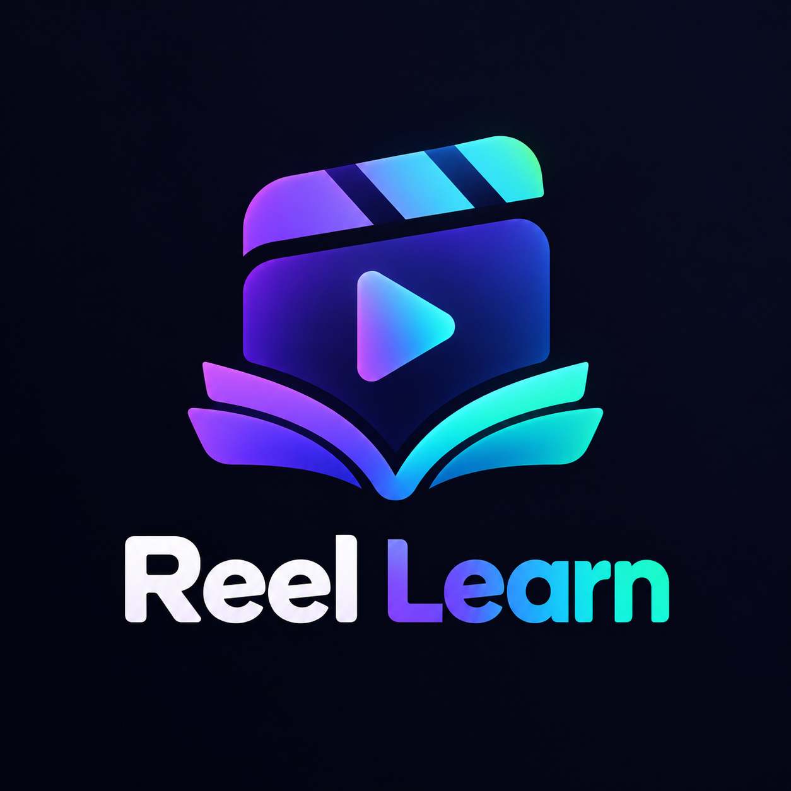

# ReelLearn 🎬

**Turn any document into swipeable, narrated study reels — entirely on-device.**

ReelLearn is an open-source React Native (Expo) app that transforms PDFs, images, and pasted text into a TikTok-style feed of short educational video reels, complete with AI-generated narration and auto-generated exams. Every AI model — the language model, text-to-speech, and OCR — runs **100% locally on your device**. No cloud APIs, no data leaving the phone.

<p align="center">
  
</p>

---

## ✨ Features

- **📄 Multi-source import** — pick a PDF or image, import a file from your library, or paste raw text.
- **🔍 On-device OCR** — PaddleOCR (via `react-native-executorch`) extracts text from images and PDF pages.
- **🧠 Local LLM script generation** — Qwen (GGUF, via `llama.rn`) writes concise, engaging reel scripts from your source material.
- **🗣️ Neural TTS narration** — Kokoro-82M (ONNX / ExecuTorch) voices each reel, with silence trimming for tight caption sync.
- **🎞️ Video rendering & export** — background videos composited with captions via Media3 Transformer, with per-reel MP4 export.
- **❓ Auto-generated exams** — the LLM builds multiple-choice quizzes from the source text; results are saved and tracked per study set.
- **📚 Library** — browse study sets, sources, and quiz history; resume interrupted generations at any point.
- **🔓 Offline & private** — models are bundled with the app and never downloaded or uploaded at runtime.

## 🏗️ Architecture

The generation pipeline runs in four stages, each holding only **one AI model in RAM at a time**:

| Stage | Model | Runtime |
|-------|-------|---------|
| 1. Text extraction | PaddleOCR (det + rec) | ExecuTorch (XNNPACK) |
| 2. Script + quiz generation | Qwen3.5-0.8B (Q8_0 GGUF) | llama.rn |
| 3. Narration | Kokoro-82M v1.0 | ExecuTorch / ONNX |
| 4. Quiz generation | Qwen (reloaded) | llama.rn |

- Pipelines are **resume-safe**: each reel's state is persisted, and stage outputs (audio, quizzes) are checked on disk before re-running.
- Progress is reported with weighted percentages (LLM 40% / TTS 60%).
- Junk-filter heuristics keep OCR/layout artifacts (font names, page numbers, margins) out of LLM prompts and generated questions.
- Local storage uses `expo-sqlite` for study sets, sources, reels, quizzes, and settings.

## 📦 Bundled models

All models live in the `models/` directory and are bundled via Metro asset `require()` calls, then staged into app storage on first use (`src/services/ai/model-registry.ts`):

| Model | File | Purpose |
|-------|------|---------|
| Qwen3.5-0.8B (Q8_0) | `models/llm/Qwen3.5-0.8B-Q8_0.gguf` | Script & quiz generation |
| Kokoro-82M v1.0 (q8f16) | `models/tts/model_q8f16.onnx` (+ voice bin) | Narration |
| PaddleOCR v5/v6 | `models/ocr/*.onnx` | Text detection & recognition |

> ⚠️ These model files are large. Because of GitHub's file-size limits, you may want to host them via [Git LFS](https://git-lfs.com) or provide a download script for contributors. Nothing is fetched at runtime by the app itself.

## 🚀 Getting started

### Prerequisites

- Node.js 18+
- Android Studio (Android) and/or Xcode (iOS)
- The model files above placed in `models/` (see table)

### Install & run

```bash
git clone https://github.com/<your-username>/ReelLearn.git
cd ReelLearn
npm install       # runs scripts/patch-metro.js postinstall — see note below
npm run android   # or: npx expo run:android
```

### Getting the AI models (required)

The AI model files are **not** included in the repo (too large for plain git). Download them manually and place each one at this exact path — the app resolves them with Metro asset `require()` calls in `src/services/ai/model-registry.ts`, so the file names must match:

```
models/
  llm/
    Qwen3.5-0.8B-Q8_0.gguf        ← the LLM (scripts + exam generation)
  tts/
    model_q8f16.onnx              ← Kokoro-82M TTS model
    af.bin                        ← Kokoro voice pack (af_heart voice)
  ocr/
    inference.onnx                ← PaddleOCR recognition model
    ppocrv5_det.onnx              ← PaddleOCR detection model
    inference.yml                 ← PaddleOCR character dictionary
```

For the Qwen LLM specifically:

1. Download `Qwen3.5-0.8B-Q8_0.gguf` (Q8_0 quantization, ~0.8B params) from the [Qwen GGUF releases on Hugging Face](https://huggingface.co/Qwen).
2. Place it at **`models/llm/Qwen3.5-0.8B-Q8_0.gguf`** in the project root.

> If you use a different GGUF file (another Qwen size or quant), rename it to exactly `Qwen3.5-0.8B-Q8_0.gguf` **or** edit the `fileName` + `source` path in the `qwen` entry of `bundledModels` in `src/services/ai/model-registry.ts`.

The app stages these files into app storage on first use — it never downloads anything at runtime. If a model file is missing, generation fails loudly with a `ModelMissingError` naming the file.

### Billing (RevenueCat)

The app gates full access behind a RevenueCat paywall (Test Store in debug builds for development):

1. Create a free [RevenueCat](https://www.revenuecat.com) project and entitlement.
2. Add a `.env` file in the project root (**never commit it**) containing:
   ```
   EXPO_PUBLIC_CAT_KEY=your_revenuecat_public_sdk_key
   ```
3. Restart Metro **cold** (`npx expo start -c`) so the env var is picked up.

Without a valid key the app fails closed to the paywall. For a fully free/open build, replace `src/services/billing/revenuecat.ts` with `useHasAccess: () => ({ hasAccess: true, isLoading: false })`.

### Metro patch note

`scripts/patch-metro.js` runs on `npm install` and patches `react-native-video-pipeline` so it compiles against the Media3 1.9.0 version pinned by `expo-video` — it fixes the `OverlaySettings` API rename and chunks overlay effects into groups of ≤15 per `OverlayEffect` (Media3 hard limit). Do not remove the postinstall hook.

## 🧱 Tech stack

- **Expo 57 / React Native 0.86** with expo-router, expo-video, expo-sqlite, expo-file-system
- **llama.rn** — on-device GGUF inference
- **react-native-executorch** — ExecuTorch TTS & OCR
- **react-native-video-pipeline / Media3 Transformer** — reel composition & MP4 export
- **RevenueCat** — paywall & entitlements
- **Tamagui** — UI primitives & theming

## 📁 Project layout

```
src/
  app/           # expo-router screens (tabs, watch, quiz, generation…)
  components/    # UI + feature components
  features/      # billing, reels, feature screens
  services/
    ai/          # pipeline, model registry, LLM, TTS, OCR, quiz-gen
    billing/     # RevenueCat integration
    storage/     # sqlite database & repositories
  i18n/          # string catalog
  models/        # shared TypeScript types
models/          # bundled AI model files (GGUF / ONNX / voice bins)
scripts/         # postinstall Metro/native patch
```

## 🤝 Contributing

Issues and PRs are welcome! Because the AI stack is heavily native, please test on a real device — emulators often lack the RAM/acceleration for on-device inference.

## 📄 License

Released for the open-source community. Add your chosen license (e.g. MIT / Apache-2.0) in a `LICENSE` file before publishing.
